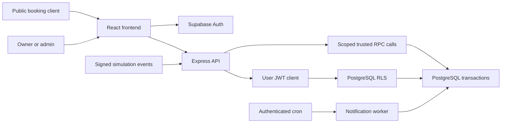

# Steadly — multi-tenant appointment SaaS

A complete source implementation of the required booking platform in **Jay Interview Task.pdf**, with a restrained ivory, charcoal, and muted-green interface. React lives in `Frontend`; the Express API, Supabase migration, and setup utilities live in `Backend`.

**Current status (7 October 2026):** the existing production site connects successfully to Supabase. The original four demo workspaces contain the seeded 1,000 appointments/240 customers plus later manual/QA history. This update adds searchable timezones, owner/admin profiles, and animated simulated payments with receipts/history. Targeted browser checks and 25 API/database checks passed using demo data. Apply incremental migration `002_booking_conflict.sql` and deploy both updated folders. See [the current PDF audit and release steps](docs/PDF_REQUIREMENTS_AUDIT.md) for exact evidence, remaining gaps, and literal PDF differences. A maintained automated test/CI suite is still outstanding.

## Start here

**Private visitor demo (8 October 2026):** the landing/auth/dashboard entry points now offer a private demo without signup, a 12-feature guided walkthrough, and Reset to return to your own workspace. Each visitor gets a distinct Supabase tenant with 40 fictional clients and 184 appointments. Existing accounts reuse their own demo; guest sessions remain separate. See [PRIVATE_DEMO_GUIDE.md](docs/PRIVATE_DEMO_GUIDE.md) for deployment, tenancy, presentation steps and operational limits. Apply migration `003_private_demo_allowance.sql` after `002`, then redeploy both folders. These local changes are not yet confirmed on the public hosting deployments.

For the complete current path from local setup and the `PGRST205` fix through GitHub, Google sign-in, Vercel frontend hosting, and Render backend/cron hosting, follow [SETUP_AND_DEPLOYMENT.md](SETUP_AND_DEPLOYMENT.md). This is the consolidated step-by-step guide.

For the already-saved demos, role logins, deployment corrections, and manual checks across every feature, use [DEMO_WORKFLOW_GUIDE.md](DEMO_WORKFLOW_GUIDE.md). Demo passwords are in the ignored local `DEMO_ACCESS.local.md` file. Use `npm run seed:rich` from Backend only for an explicit seed/resume, never as a startup command.

1. Read [how to run](docs/HOW_TO_RUN.md).
2. For a new database, apply migrations in order starting with [001](Backend/supabase/migrations/001_initial.sql). For your already-populated database, apply [002](Backend/supabase/migrations/002_booking_conflict.sql) if still pending, then [003](Backend/supabase/migrations/003_private_demo_allowance.sql); do not recreate existing tables.
3. Configure Supabase Auth URLs as described in the run guide.
4. Start the backend and frontend in separate terminals:

```powershell
cd Backend
npm ci
npm run dev
```

```powershell
cd Frontend
npm ci
npm run dev
```

5. Open `http://localhost:5173`, register, confirm your email if required, and create a business.
6. Add services, add a provider, assign services to the provider, and configure availability.
7. Share `/booking/your-business-slug`.

The supplied Supabase URL and keys have been placed in ignored local environment files. The server-only service-role key is **only** in `Backend/.env`. The `.env.example` files contain placeholders. If reproducing from a checkout, copy the examples and supply your own values. Read-only authenticated API checks confirmed demo data can be retrieved and subscription gating applies; full manual mutation workflows remain unverified.

## Stack and structure

- React 19, React Router, Vite, plain CSS, Lucide icons, Luxon for browser timezone presentation.
- Node.js 22.12+ and Express 5, Zod validation, Helmet, intentional CORS, public rate limiting.
- Supabase Auth and PostgreSQL, tenant RLS, composite foreign keys, exclusion constraint, transactional functions.
- Vercel-compatible frontend and backend deployment configuration, protected cron endpoint.
- Transactional notification mock adapter and signed HMAC billing simulation.

```text
Frontend/
  src/
    pages/             Landing, auth, booking, dashboard, CRM, configuration, billing
    context.jsx        Auth and selected-workspace state
    lib.js             API client and date/money presentation
    ui.jsx             Shared UI and resource loading
    styles.css         Responsive design system
Backend/
  src/
    app.js             Public and tenant-authorized API routes
    validation.js      Request schemas
    db.js              User JWT and trusted system clients
    notifications.js   Notification job processor and mock adapter
    config.js          Validated server environment
  api/index.js         Vercel entry point
  supabase/migrations/001_initial.sql
  scripts/             Optional two-business seed and signed billing simulator
docs/
  HOW_TO_RUN.md
  COMPLETION.md
  WORKFLOWS.md
  TEST_CASES.md
  ARCHITECTURE.md
  API.md
```

## Architecture



Private CRUD uses the user's JWT, membership checks, and RLS. Public booking and privileged system operations use a server-only client with narrow response projections and validated tenant context. Availability and final booking validation share the same SQL function. PostgreSQL serializes changes per business and rejects overlapping provider appointments even under concurrency.

## Documentation and verification

- [Run and deployment guide](docs/HOW_TO_RUN.md): variables, migration/RLS, optional seed, jobs, billing, Vercel, troubleshooting.
- [Completion percentages](docs/COMPLETION.md): implemented artifacts versus unverified runtime behavior.
- [Workflows and roles](docs/WORKFLOWS.md): public client, owner, admin, provider resource, scheduler, billing.
- [Detailed test-case list](docs/TEST_CASES.md): planned manual/unit/integration/E2E cases; **all unexecuted**.
- [Architecture and trade-offs](docs/ARCHITECTURE.md): tenant boundary, races, DST, state rules, metrics, scaling, limitations.
- [API reference](docs/API.md): endpoints, auth headers, error contract, request examples.

There is no `npm test` script and no test suite, per the explicit request. `npm run build` in `Frontend` compiles production assets; it is not a workflow test. JavaScript syntax checks do not establish correctness of the SQL or live integration. See the completion report for actual checks performed.

**Live demo:** not deployed; no production URL is claimed. Vercel configuration is included for both folders. No remote repository, commits, or cloud deployment were created.

## Main limitations

The SQL migration must be applied before the app can use live data. A Supabase anon or service-role API key is not a SQL editor or database password. Auth delivery settings and production hosting credentials must be configured in their respective dashboards.

Email/SMS delivery and paid billing are simulated. Core flows have source implementations but have not been runtime-tested. The basic rate limiter is per process; production serverless deployments should add distributed abuse controls. Staff/provider records represent schedulable resources rather than staff login accounts. Member invitation UI, optional AI features, waitlists, iCal export, and public self-service rescheduling are outside the required baseline. See the architecture guide for details.
