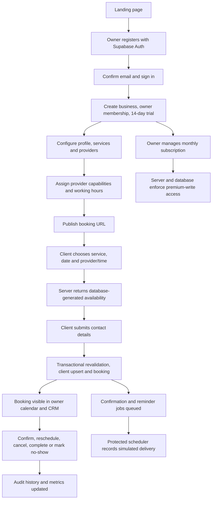
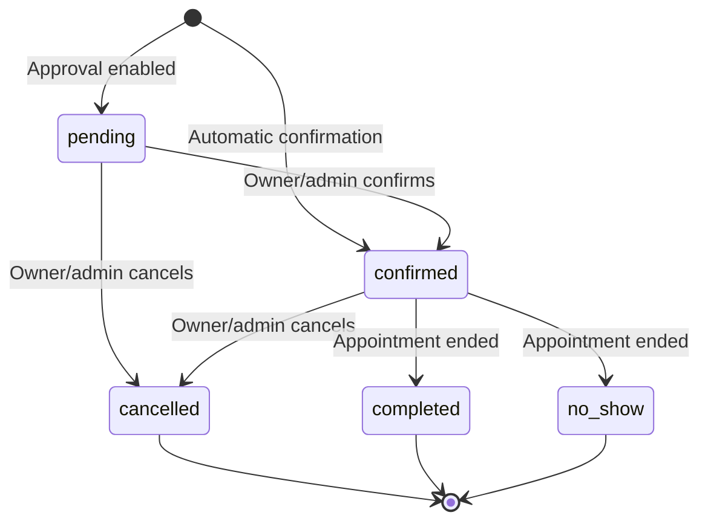

# Whole-project and role workflows

These describe the implemented application paths, not executed test results. The migration must be applied and the app configured before using them.

## 1. Whole-project lifecycle

## 2. Public client — no account required

1. Visit `/booking/:business-slug` from a link shared by the business.
2. The API resolves an active business by slug. Unknown or paused businesses return an unavailable page.
3. View public name, description, contact details, timezone, active services, prices, and durations.
4. Select a service. Select a preferred eligible provider or leave **Any available provider** selected.
5. Choose a business-local date, from today through 90 days ahead.
6. The database generates concrete provider/time slots. Closed hours, blocked periods, occupied slots, past times, and inactive/unassigned providers are excluded.
7. Choose one slot. Every slot includes a provider even when the client chose “any provider.”
8. Enter name, email, phone, and an optional appointment message. No CRM notes are visible here.
9. Submit once. The button disables while pending; the client preserves an idempotency key for retries of the same payload.
10. The server revalidates the slot inside a transaction. A lost race produces a 409 conflict and asks the client to choose a new time.
11. On success, view reference ID, price, date/time, provider, and booking status.
12. If approval is enabled, the booking is `pending`; otherwise it is `confirmed`. Both reserve the provider's time.
13. Confirmation and reminder jobs are queued for enabled channels. The mock adapter records delivery when the worker runs.
14. The client contacts the business for changes. Public self-service rescheduling and cancellation tokens are optional PDF bonuses and are not included.

The public API cannot fetch booking lists, CRM records, private notes, subscription state, audit metadata, or notification history. A retry key is not a general booking-lookup token.

## 3. Business owner

### Account and tenant onboarding

1. Open `/signup`, register using email/password, and follow any Supabase email-confirmation requirement.
2. Sign in at `/login`; forgotten passwords use Supabase recovery and `/reset-password`.
3. Create a business with name, unique slug, and timezone. The server-side function uses `auth.uid()` as owner.
4. The transaction creates the business, owner membership, seven default hours rows, and a 14-day subscription trial.
5. The account may create up to five businesses. Switch businesses from the workspace selector; server membership and RLS validate every selection.

### Configure the offering

1. **Settings:** update description, public contact information, timezone, currency, published/paused state, booking approval, and notification preferences.
2. **Services:** create or edit name, description, duration (5–480 minutes), price, and active state. Enter prices in major currency units; storage uses integer minor units.
3. **Providers:** add bookable resources and assign services each one can perform. A solo owner should add themselves as a provider.
4. **Availability:** set one working window per business day. Optionally set provider-specific windows; these intersect with business windows.
5. Disable a provider day to make them unavailable, or use **Use business hours** to remove overrides.
6. Add business-wide or provider-only blocked periods for leave, lunch, or holidays.
7. Share **Your booking page**. Deactivating a service/provider prevents new appointments but retains existing history.

Schedule changes do not automatically cancel existing bookings. The UI explains this and the owner should reschedule affected appointments explicitly. Currency cannot change after bookings exist.

### Day-to-day operations

1. **Overview:** see today's appointments, active appointments over the next seven days, completed revenue, distinct CRM clients, and no-show rate.
2. **Calendar:** use day/week/month views, change the date, filter by provider, and open an appointment. All timestamps use the business timezone.
3. **Bookings:** browse the paginated list and filter by state.
4. Open a booking to see service, client contact details, provider, price, client message, and audit history.
5. Confirm a pending booking, reschedule a future nonterminal booking, or cancel it.
6. After a confirmed booking ends, mark it completed or no-show. These states are terminal.
7. Each change submits the displayed version. If another administrator changed the booking first, the API rejects the stale mutation and asks for a refresh.

### CRM

1. A successfully booked email becomes one tenant-local client record. Repeated bookings with the same normalized email update name/phone but retain private notes.
2. Search clients by name, email, or phone.
3. Open the profile for paginated booking history, completed lifetime value, last completed appointment, and nearest future pending/confirmed appointment.
4. Add or edit private business notes. These are separate from client-supplied appointment messages.
5. The same email may exist independently in multiple tenants, with separate histories and notes.

### Subscription and notifications

1. **Billing** shows current state and period end even when premium access is unavailable.
2. Start and confirm a simulated monthly checkout, or cancel immediately after the confirmation click.
3. **Notifications** displays queued/sent/failed/skipped jobs and delivery-attempt logs.
4. An owner cannot forge subscription status by directly editing Supabase rows; browser roles have no subscription-write grant.
5. Only the trusted scheduler processes notification jobs; the UI does not receive cron credentials.

## 4. Business admin

The schema supports `admin` memberships in addition to `owner`. An admin can use the tenant's overview, calendar, booking actions, CRM, services, providers, schedules, business profile, and notification records under the same RLS boundary.

This implementation reserves subscription changes for the owner. Admins can view subscription state but receive an owner-only restriction for checkout completion and cancellation. This is an explicit least-privilege refinement of the specification's combined owner/admin role.

There is no staff invitation or membership editor in the baseline UI. To provision an admin deliberately, a trusted project operator can create/identify the user's Supabase Auth account and insert an `admin` row into `business_members` through the SQL editor. Browser users cannot create or modify membership rows. Do not publish an unauthenticated membership API.

## 5. Provider / staff resource

A provider represents a schedulable person/resource, not an authenticated user role. It has a name, active state, assigned services, and optional working-hour overrides. Providers do not receive login credentials or a separate portal from this implementation.

Different providers can accept appointments at the same time. A single provider cannot have overlapping non-cancelled bookings. Provider-specific hours never expand the business's operating hours.

## 6. System / scheduler

1. A scheduler calls the protected reminder endpoint using its server-held bearer secret.
2. PostgreSQL claims up to 50 eligible jobs with `FOR UPDATE SKIP LOCKED`.
3. Claims receive a lease token, attempt counter, and locked timestamp. Concurrent workers cannot claim the same live lease.
4. The adapter rechecks booking version, state, start time for reminders, and channel preference while holding the same tenant transaction lock used by booking mutations.
5. Stale, cancelled, expired, or disabled jobs become `skipped`.
6. Valid jobs generate a `simulated` notification-log record and become `sent` in one transaction.
7. Failures are recorded, rescheduled after five minutes, and retried at most three times.
8. Abandoned processing leases can be reclaimed after five minutes; exhausted ones become failed.
9. Sent jobs are not reclaimed. A unique booking/channel/template/version key prevents duplicate jobs.

“Sent” in the job table means successfully processed by the configured mock adapter; the corresponding log says **simulated**. No real email or SMS is delivered.

## 7. Billing system / project operator

1. Simulated checkout sessions are created only for authenticated owners and expire after 30 minutes.
2. Completion derives the business and actor from validated server context, never client-supplied price or subscription status.
3. A trusted simulator can send signed subscription lifecycle webhooks.
4. The API verifies HMAC-SHA256 over timestamp + exact body bytes, checks the five-minute timestamp window, validates the schema, and rejects unsigned/tampered input.
5. The transactional handler records each event ID once and ignores events older than the last applied event.
6. Subscription writes remain inaccessible to ordinary Supabase browser roles.
7. Active/trial access ends at period end. Past-due access lasts through a three-day grace period. Cancelled/incomplete status blocks premium APIs immediately.

## 8. Booking state machine

Rescheduling preserves pending/confirmed status and creates a new version. It is allowed only before the existing appointment starts and only into a newly validated future slot. Terminal states cannot be reopened.
